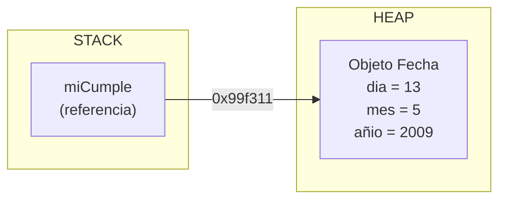
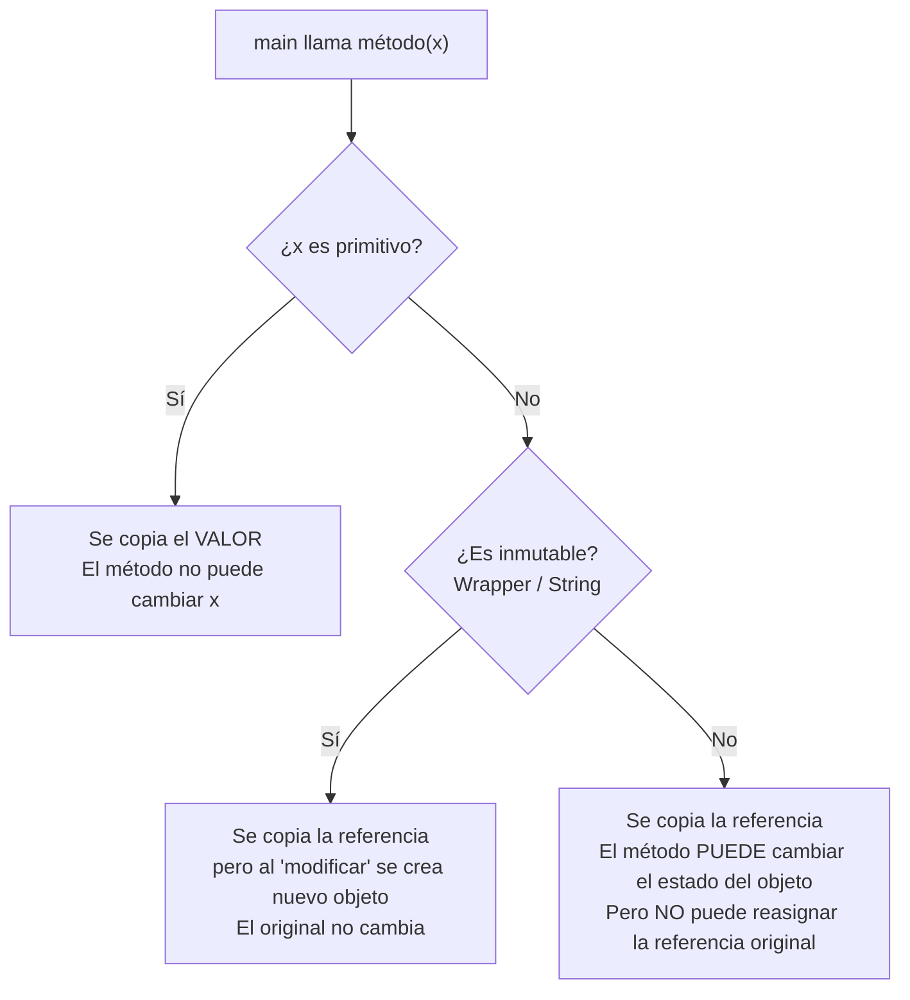

# AyED — Clase 1: Java OOP, Clases, Arreglos y Pasaje de Parámetros
`Algoritmos y Estructuras de Datos 2026 | UNLP Informática`

---

## Contexto de Conexión

> 📌 Tema inicial de la materia. No hay hilo previo.

Esta clase es un repaso de Java orientado a objetos, necesario antes de arrancar con las estructuras de datos (listas, pilas, colas, árboles). La idea es que todos partan del mismo punto sobre cómo funciona Java por debajo: cómo se crean objetos, qué pasa en memoria, cómo se pasan parámetros.

---

## Conceptos Core

- **Clase**: molde o plantilla que define el estado (variables de instancia) y el comportamiento (métodos) de los objetos que se crean a partir de ella.
- **Objeto / Instancia**: entidad en memoria creada a partir de una clase. Vive en el **HEAP**.
- **Variable de instancia**: pertenece al objeto. Existe mientras el objeto exista. Se declara `private` por convención.
- **Variable local**: declarada dentro de un método. Existe solo mientras el método se ejecuta. **Debe inicializarse explícitamente** antes de usarse.
- **Constructor**: bloque de código que inicializa el objeto al crearlo. Mismo nombre que la clase, sin tipo de retorno.
- **`this`**: referencia al objeto actual. Disponible automáticamente en todos los métodos de instancia.
- **`static`**: modifica variables o métodos para que pertenezcan a la **clase** en vez de a cada instancia. Se comparten entre todos los objetos.
- **Bytecode**: lo que genera el compilador Java (`javac`). No es código nativo — lo ejecuta la JVM (Java Virtual Machine).
- **Autoboxing / Unboxing**: conversión automática del compilador entre primitivos (`int`) y sus wrappers (`Integer`), y viceversa.
- **Pasaje por valor**: Java siempre pasa copias. Para primitivos, la copia es el valor. Para objetos, la copia es la **referencia** (la dirección del objeto en heap).

---

## Desarrollo

### La Plataforma Java

El ciclo de vida de un programa Java tiene dos pasos:

```
Programa.java  →[javac]→  Programa.class  →[JVM]→  Ejecución
```

- **`javac`**: compilador. Convierte el código fuente a **bytecodes** (`.class`).
- **JVM / `java`**: intérprete. Ejecuta los bytecodes en cualquier plataforma.

Esto es lo que hace a Java "write once, run anywhere": el `.class` es el mismo en todos los sistemas operativos; la JVM se adapta a cada uno.

---

### Programación Orientada a Objetos

Un programa OO es una red de objetos que se comunican enviándose **mensajes** (invocando métodos entre sí). Cada objeto tiene:

- **Estado**: sus variables de instancia (datos)
- **Comportamiento**: sus métodos (operaciones)

Los objetos se crean en el **HEAP** durante la ejecución. La clase es el molde; los objetos son las instancias concretas.

---

### Declarar una clase en Java

Estructura mínima:

```java
package whatsapp;           // obligatorio, primera línea
import java.awt.Image;      // imports si se necesitan

public class Contacto {     // nombre del archivo == nombre de la clase
    // variables de instancia (estado)
    private String nombre;
    private Image imagen;
    private String estado;
    private int id;

    // métodos de instancia (comportamiento)
    public String getNombre() {
        return nombre;
    }
    public void setNombre(String nombre) {
        this.nombre = nombre;    // this distingue atributo de parámetro
    }
}
```

Reglas:
- El archivo `.java` debe llamarse exactamente igual que la clase pública (con mayúsculas respetadas).
- Las variables de instancia van **`private`** — solo accesibles desde adentro de la clase.
- Los métodos de acceso (`get`/`set`) van **`public`**.

---

### Tipos de datos en Java

Hay dos categorías:

| Categoría | Descripción | Ejemplos |
|---|---|---|
| **Primitivos** | Valores simples, no son objetos, guardados en stack | `int`, `double`, `char`, `boolean`, `byte`, `short`, `long`, `float` |
| **Referenciales** | Variable guarda la **dirección** del objeto en heap | `String`, `Contacto`, `Integer`, cualquier clase |

**Valores por defecto de variables de instancia** (si no se inicializan explícitamente):

| Tipo | Valor por defecto |
|---|---|
| `boolean` | `false` |
| `char` | `'\u0000'` (nulo) |
| `byte`/`short`/`int`/`long` | `0` |
| `float`/`double` | `0.0` |
| Referencia a objeto | `null` |

> ⚠️ Las **variables locales** (dentro de un método) NO tienen valor por defecto — hay que inicializarlas antes de usarlas o el compilador falla.

---

### Clases Wrapper

Java provee una clase "envoltorio" para cada tipo primitivo, que permite tratarlos como objetos:

| Primitivo | Wrapper |
|---|---|
| `int` | `Integer` |
| `double` | `Double` |
| `char` | `Character` |
| `boolean` | `Boolean` |
| `long` | `Long` |
| `float` | `Float` |

Las wrappers son **inmutables** (igual que `String`): si "modificás" el valor, se crea un nuevo objeto.

**Autoboxing** (primitivo → wrapper, automático):
```java
Integer i = 7;       // Java convierte int 7 → Integer
Character c = 'a';
```

**Unboxing** (wrapper → primitivo, automático):
```java
int i1 = i;         // Java convierte Integer → int
char c1 = c;
```

**Impacto en performance:** usar `Long` (wrapper) en un loop intensivo es ~7x más lento que `long` (primitivo) porque cada operación crea nuevos objetos en heap.

---

### Creación de objetos (`new`)

```java
Fecha miCumple;              // 1. declara variable (en STACK, vale null)
miCumple = new Fecha();      // 2-5. crea objeto en HEAP
```

Lo que hace `new` internamente:
1. Aloca espacio para la variable en STACK
2. Aloca espacio para el objeto en HEAP e inicializa atributos con valores por defecto
3. Inicializa explícitamente los atributos que tengan valores en la definición
4. Ejecuta el constructor
5. Asigna la referencia del objeto a la variable

---

### Constructores

```java
public class Vehiculo {
    private String marca;
    private double precio;

    // Constructor sin argumentos (default)
    public Vehiculo() { }

    // Constructor con argumentos
    public Vehiculo(String marca, double precio) {
        this.marca = marca;
        this.precio = precio;
    }
}
```

Reglas:
- Mismo nombre que la clase.
- **No retorna nada** (ni siquiera `void`).
- Si no se define ningún constructor, el compilador inserta uno vacío automáticamente.
- Si se define **al menos uno**, el compilador **no agrega** el default — hay que ponerlo explícitamente si también se lo quiere.

**Sobrecarga de constructores**: se pueden tener varios constructores con distintos parámetros:

```java
Vehiculo a1 = new Vehiculo();                    // constructor vacío
Vehiculo a2 = new Vehiculo("HONDA");             // con marca
Vehiculo a3 = new Vehiculo("HONDA", 12300.50);   // con marca y precio
```

---

### Variables y métodos `static`

`static` = pertenece a la **clase**, no a cada instancia. Se comparte entre todos los objetos.

```java
public class Contacto {
    private static int ultCont = 0;   // variable de clase
    private int id;

    public Contacto() {
        ultCont++;
        this.id = ultCont;
    }

    public static int getUltCont() {  // método de clase
        return ultCont;
    }
}
```

```java
// Se puede invocar sin crear ningún objeto:
Contacto.getUltCont();
```

> ⚠️ Los métodos `static` solo pueden acceder a variables `static` y parámetros/locales. **No tienen acceso a variables de instancia** (porque no saben a qué objeto apuntar — no existe `this`).

---

### Arreglos en Java

Un arreglo es un **objeto** en heap que agrupa valores del mismo tipo en posiciones contiguas. Tamaño fijo desde la creación.

```java
// Declaración + creación + inicialización en pasos
int[] intArray;
intArray = new int[5];
intArray[0] = 6; intArray[1] = 3; // ...

// Todo en un paso
int[] intArray = {6, 3, 2, 4, 9};

// Arreglo de objetos
Cliente[] cliArray = new Cliente[3];
cliArray[0] = new Cliente();   // cada posición también necesita new
```

- Índices van de `0` a `length - 1`.
- `array.length` da el tamaño.
- Arreglo de objetos: cada posición guarda una **referencia**, no el objeto directamente.

**Recorrido:**

```java
// For tradicional
for (int i = 0; i < a.length; i++) {
    System.out.println(a[i]);
}

// For-each (más limpio cuando no necesitás el índice)
for (int elto : a) {
    System.out.println(elto);
}
```

**Matrices (arreglos 2D):**

```java
int[][] notas = {
    {66, 78, 78, 89, 88, 90},
    {76, 80, 80, 82, 90, 90},
    {90, 92, 87, 83, 99, 94}
};

// notas[2][3] → 83 (fila 2, columna 3)
// notas.length → cantidad de filas (3)
// notas[x].length → cantidad de columnas de la fila x (6)
```

---

### Pasaje de parámetros

**Java siempre pasa por valor** — lo que varía es qué se copia:

| Tipo de parámetro | Qué se copia | ¿El método puede modificar el original? |
|---|---|---|
| Primitivo (`int`, `double`...) | El valor | ❌ No |
| Wrapper (`Integer`, `String`...) | La referencia, pero son inmutables → se crea nuevo objeto | ❌ No |
| Objeto mutable | La referencia (dirección del objeto en heap) | ✅ Sí (el estado del objeto) |

```java
// Primitivo: la modificación dentro del método NO afecta al original
public static void pedirEdades(int edad1, int edad2) {
    edad1 = 56; // solo modifica la copia local
}
int edadMadre = 0;
pedirEdades(edadMadre, ...);
// edadMadre sigue siendo 0
```

```java
// Objeto mutable: SÍ se puede cambiar el estado del objeto
public static void cambiarNombre(Contacto c) {
    c.setNombre("Pilar");  // modifica el objeto real en heap
}
Contacto c = new Contacto();
c.setNombre("Lucia");
cambiarNombre(c);
System.out.println(c.getNombre()); // imprime "Pilar"
```

> ⚠️ Si dentro del método hacés `c = new Contacto()`, eso **no afecta** a la referencia original — solo cambia la copia local de la referencia.

---

### Devolver múltiples valores desde un método

Java no tiene retorno múltiple nativo. La solución es **crear un objeto que los encapsulee**:

```java
// Clase contenedora
public class Datos {
    private int min;
    private int max;
    // getters y setters...
}

// Método que devuelve el objeto
public static Datos maxmin(int[] datos) {
    int max = datos[0], min = datos[0];
    for (int i = 1; i < datos.length; i++) {
        if (datos[i] > max) max = datos[i];
        if (datos[i] < min) min = datos[i];
    }
    Datos resultado = new Datos();
    resultado.setMax(max);
    resultado.setMin(min);
    return resultado;
}

// Uso
Datos maxmin = Calculadora.maxmin(datos);
System.out.println(maxmin.getMax()); // 8
System.out.println(maxmin.getMin()); // 0
```

---

## Visualización

### Stack vs. Heap al crear un objeto



### Pasaje de parámetros: primitivo vs. objeto



---

## Lo que no podés ignorar

> 1. **Variables locales no tienen valor por defecto** — el compilador no las inicializa automáticamente. Las de instancia sí.
> 2. **`static` no tiene `this`** — un método estático no puede acceder a variables de instancia porque no pertenece a ningún objeto en particular.
> 3. **Java pasa por valor siempre** — para objetos, lo que se pasa es una copia de la referencia, no el objeto en sí. Se puede mutar el estado del objeto, pero no reemplazarlo desde afuera.
> 4. **Si definís un constructor con argumentos, perdés el default** — hay que agregarlo explícitamente si lo necesitás.
> 5. **Arreglo de objetos necesita dos `new`** — uno para el arreglo y otro para cada objeto dentro: `new Cliente[3]` crea 3 posiciones `null`, no 3 objetos `Cliente`.
