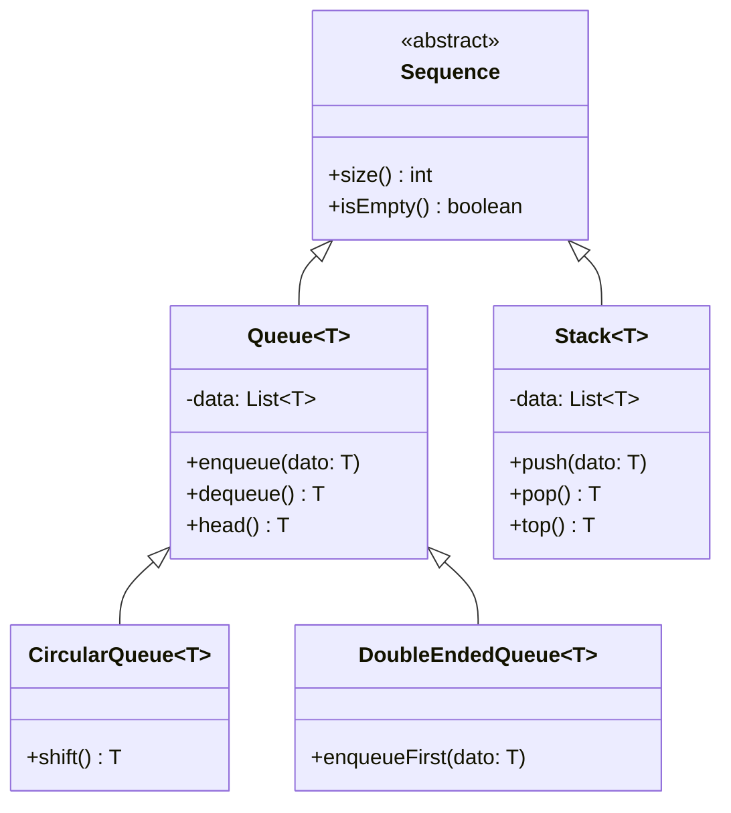
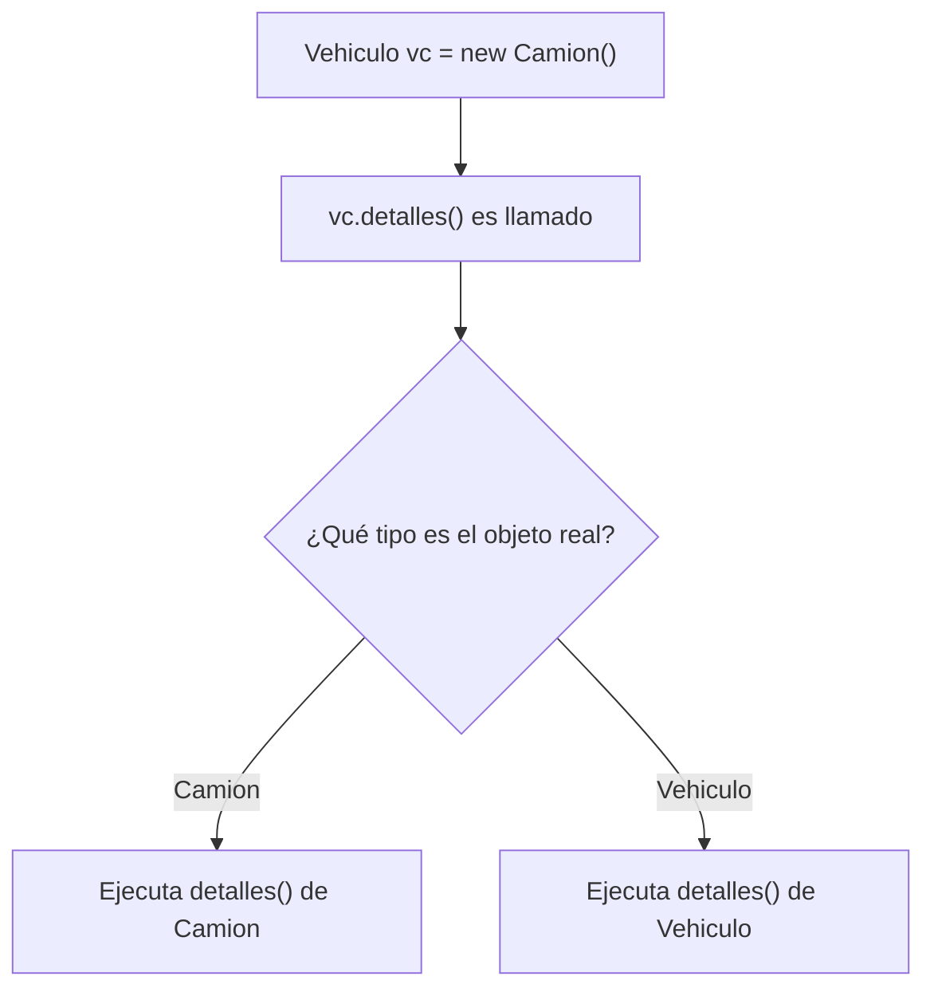

# AyED 2026 — Semana 2: Herencia, Clases Abstractas y Colecciones en Java

---

## Contexto de Conexión

La semana pasada establecimos las bases de la POO: clases, objetos, atributos y métodos. Ahora damos el salto conceptual clave: **¿cómo relacionamos clases entre sí para reutilizar código y modelar jerarquías?** Eso es herencia. Y sobre esa base, entendemos cómo se implementan las estructuras de datos fundamentales (Listas, Pilas, Colas) en Java.

---

## Conceptos Core

- **Herencia**: mecanismo por el cual una clase (subclase) adquiere los atributos y métodos de otra (superclase). Representa la relación *"es un"*.
- **Superclase / clase base**: la clase de la que se hereda.
- **Subclase / clase derivada**: la clase que hereda. Se declara con `extends`.
- **Sobrescritura (override)**: redefinir en la subclase un método que ya existe en la superclase, con el **mismo nombre, tipo de retorno y lista de parámetros**.
- **`super`**: palabra clave para acceder a métodos o constructores de la superclase desde la subclase.
- **Upcasting**: tratar una referencia de subclase como si fuera de la superclase. Es seguro y automático.
- **Downcasting**: recuperar el tipo específico desde una referencia de superclase. Requiere casteo explícito y puede fallar en runtime.
- **Binding dinámico**: el método que se ejecuta se determina en tiempo de ejecución según el tipo real del objeto, no el tipo de la variable.
- **Clase abstracta**: clase que no puede instanciarse directamente. Sirve como molde para sus subclases.
- **Método abstracto**: método sin cuerpo (solo firma). La subclase concreta está obligada a implementarlo.
- **TDA (Tipo de Dato Abstracto)**: tipo definido por sus operaciones y restricciones, sin importar la implementación.
- **Tipos Genéricos (`<T>`)**: permiten parametrizar el tipo de dato que maneja una clase, brindando seguridad en compilación.
- **Iterador**: patrón que permite recorrer una colección sin exponer su estructura interna.

---

## Desarrollo

### 1. Herencia con `extends`

En Java la herencia es **simple**: cada clase puede tener solo una superclase directa. Pero se permiten múltiples niveles (A → B → C).

```java
public class Vehiculo {
    private String marca;
    private double precio;

    public String getMarca() { return marca; }
    public double getPrecio() { return precio; }
    // ... más getters/setters
}

public class Camion extends Vehiculo {
    private int cargaMaxima;
    private boolean tieneDobleCaja;

    public int getCargaMaxima() { return cargaMaxima; }
    // Camion hereda automáticamente getMarca(), getPrecio(), etc.
}
```

Al instanciar un `Camion`, se pueden invocar todos los métodos heredados de `Vehiculo` **y** los propios de `Camion`.

---

### 2. Sobrescritura de métodos

Una subclase puede reemplazar un método de la superclase. La condición: **mismo nombre + mismo tipo de retorno + mismos parámetros**.

```java
// En Vehiculo:
public String detalles() {
    return "Marca: " + getMarca() + "\nPrecio: " + getPrecio();
}

// En Camion (sobrescribe):
public String detalles() {
    return "Marca: " + getMarca() + "\nPrecio: " + getPrecio()
         + "\nCarga máxima: " + getCargaMaxima();
}
```

Con `super` se puede reutilizar la lógica de la superclase en lugar de repetirla:

```java
// Versión mejorada en Camion:
public String detalles() {
    return super.detalles() + "\nCarga máxima: " + getCargaMaxima();
}
```

---

### 3. Upcasting, Downcasting y Binding Dinámico

```java
Vehiculo vc = new Camion();  // ✅ upcasting automático
vc.detalles();               // ejecuta el detalles() de Camion → binding dinámico
vc.setCargaMaxima(3000);     // ❌ NO compila: Vehiculo no conoce ese método
```

> La variable `vc` es de tipo `Vehiculo`, pero el objeto real es un `Camion`. El binding dinámico hace que `detalles()` ejecute la versión de `Camion`.

Para recuperar el tipo específico (downcasting):

```java
Camion c = (Camion) vc;  // downcasting explícito
c.setCargaMaxima(3000);  // ✅ ahora sí funciona
```

Usar `instanceof` antes de castear para evitar errores en runtime:

```java
if (vc instanceof Camion) {
    Camion c = (Camion) vc;
}
```

---

### 4. La clase `Object`

Toda clase en Java extiende implícitamente de `Object` (del paquete `java.lang`). Esto nos da dos métodos importantes que conviene sobrescribir:

| Método | Comportamiento original | Por qué sobrescribirlo |
|--------|------------------------|------------------------|
| `equals(Object o)` | Compara referencias (igual que `==`) | Para comparar el **contenido** de dos objetos |
| `toString()` | Devuelve dirección de memoria como String | Para obtener una representación legible |

```java
public class Fecha {
    private int dia, mes, año;

    @Override
    public boolean equals(Object o) {
        if (o == null || !(o instanceof Fecha)) return false;
        Fecha f = (Fecha) o;
        return f.getDia() == this.dia && f.getMes() == this.mes && f.getAño() == this.año;
    }

    @Override
    public String toString() {
        return dia + "-" + mes + "-" + año;
    }
}
```

---

### 5. Clases Abstractas

Cuando una clase representa un concepto que **no tiene sentido instanciar directamente** (ej: "FiguraGeometrica"), se declara abstracta.

```java
public abstract class FiguraGeometrica {
    private Color color;
    private int x, y;

    public void mover(int x, int y) { this.x = x; this.y = y; }  // método concreto

    public abstract double getArea();   // método abstracto: sin cuerpo
    public abstract void dibujar();     // la subclase DEBE implementarlo
}
```

Reglas clave:
- No se puede hacer `new FiguraGeometrica()`.
- Una clase abstracta **puede tener métodos concretos y abstractos**.
- La primera subclase concreta en la jerarquía **debe implementar todos los métodos abstractos**.
- Si una clase tiene aunque sea un método abstracto, la clase debe declararse abstracta.

```java
public class Circulo extends FiguraGeometrica {
    @Override
    public double getArea() { return Math.PI * radio * radio; }

    @Override
    public void dibujar() { /* lógica de dibujo */ }
}
```

---

### 6. TDAs: Lista, Pila y Cola

Un **TDA** define *qué* operaciones existen, no *cómo* se implementan.

#### TDA Lista
Secuencia lineal donde se puede agregar/eliminar en **cualquier posición**.

Operaciones: `add(e)`, `add(pos,e)`, `get(pos)`, `remove(pos)`, `contains(e)`, `indexOf(e)`, `size()`.

#### TDA Pila (Stack) — LIFO
El último en entrar es el primero en salir. Se opera solo por el **tope**.

Operaciones: `push(e)`, `pop()`, `top()`, `isEmpty()`, `size()`.

#### TDA Cola (Queue) — FIFO
El primero en entrar es el primero en salir. Se agrega por el **rabo** y se retira por el **frente**.

Operaciones: `enqueue(e)`, `dequeue()`, `head()`, `isEmpty()`, `size()`.

#### Jerarquía con herencia



---

### 7. Colecciones en Java — Framework

Java provee en `java.util` implementaciones listas para usar:

| TDA | Tecnología | Clase Java |
|-----|-----------|------------|
| List | Arreglo dinámico | `ArrayList` |
| List | Nodos enlazados | `LinkedList` |
| Set | Hash | `HashSet` |
| Set | Árbol | `TreeSet` |
| Map | Hash | `HashMap` |

**Las cuatro tecnologías de almacenamiento:**

| Tecnología | Acceso | Inserción/Borrado | Uso ideal |
|---|---|---|---|
| Arreglo | O(1) por índice | O(n) si hay corrimiento | Acceso frecuente, tamaño estable |
| Lista enlazada | O(n) hay que recorrer | O(1) al inicio/fin | Muchas inserciones/borrados |
| Árbol | O(log n) | O(log n) | Datos ordenados, búsqueda eficiente |
| Tabla de hash | O(1) por clave | O(1) promedio | Búsqueda rapidísima por clave |

---

### 8. ArrayList vs LinkedList

| | ArrayList | LinkedList |
|---|---|---|
| Estructura interna | Arreglo dinámico | Lista doblemente enlazada |
| Acceso por índice | O(1) ✅ | O(n) ❌ |
| Insertar/borrar al medio | O(n) | O(n) pero sin redimensionar |
| Insertar/borrar al inicio/fin | O(n) | O(1) ✅ |
| Memoria | Menor | Mayor (guarda prev + next) |
| Ideal para... | Acceso frecuente | Muchas modificaciones |

**Implementación de Stack con ArrayList** (se agrega al final para evitar corrimientos):

```java
public class Stack<T> extends Sequence<T> {
    private List<T> data = new ArrayList<T>();

    public void push(T dato) { data.add(data.size(), dato); }
    public T pop()           { return data.remove(data.size() - 1); }
    public T top()           { return data.get(data.size() - 1); }
    public int size()        { return data.size(); }
    public boolean isEmpty() { return data.size() == 0; }
}
```

**Implementación de Queue con LinkedList** (LinkedList es eficiente al inicio y al final):

```java
public class Queue<T> extends Sequence {
    private List<T> data = new LinkedList<T>();

    public void enqueue(T dato) { data.add(dato); }         // agrega al final
    public T dequeue()          { return data.remove(0); }  // saca del inicio
    public T head()             { return data.get(0); }
}
```

---

### 9. Tipos Genéricos

Sin genéricos, una lista guarda `Object` y se pierde el tipo:

```java
List lista = new ArrayList();
lista.add(new Vino(...));
lista.add("un string");  // ⚠️ válido, pero mezcla tipos
Vino v = (Vino) lista.get(0);  // hay que castear manualmente
```

Con genéricos, el compilador controla el tipo:

```java
List<Vino> lista = new ArrayList<>();
lista.add(new Vino(...));  // ✅ solo acepta Vino
Vino v = lista.get(0);    // sin casteo, tipo garantizado
```

---

### 10. Iteradores

Permiten recorrer colecciones sin conocer su implementación interna.

```java
List<Integer> lista = new ArrayList<>();
lista.add(10); lista.add(1); lista.add(12);

// Forma 1: Iterator explícito sin genérico
Iterator it = lista.iterator();
while (it.hasNext()) {
    System.out.println(((Integer) it.next()).intValue());
}

// Forma 2: Iterator genérico (sin casteo)
Iterator<Integer> it2 = lista.iterator();
while (it2.hasNext()) {
    System.out.println(it2.next().intValue());
}

// Forma 3: foreach (la más simple y recomendada)
for (Integer i : lista) {
    System.out.println(i);
}
```

Las tres formas producen la misma salida. El `foreach` es azúcar sintáctica sobre el iterador.

---

## Visualización

### Flujo de binding dinámico



---

## Lo que no podés ignorar

> 1. **Java hereda de `Object` siempre**: si no ponés `extends`, el compilador lo agrega solo. Sobrescribir `equals()` y `toString()` es una buena práctica fundamental.
> 2. **Clase abstracta ≠ interfaz**: una clase abstracta puede tener métodos concretos y estado (atributos). No se puede instanciar, pero sí puede tener constructores para que los usen sus subclases.
> 3. **Upcasting es seguro, downcasting no**: con upcasting nunca hay error. Con downcasting podés tener `ClassCastException` en runtime si el tipo real no es compatible — siempre usar `instanceof` antes.
> 4. **Binding dinámico**: el método ejecutado depende del tipo real del objeto en memoria, no del tipo de la variable. Con `Vehiculo vc = new Camion()`, `vc.detalles()` ejecuta el de `Camion`.
> 5. **ArrayList para acceso, LinkedList para modificación**: elegí según el patrón de uso. Stack → ArrayList (operaciones al final). Queue → LinkedList (operaciones en ambos extremos).
