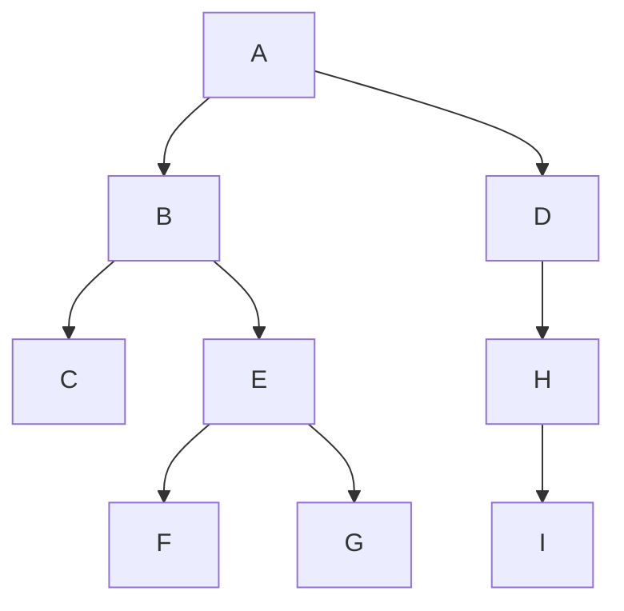
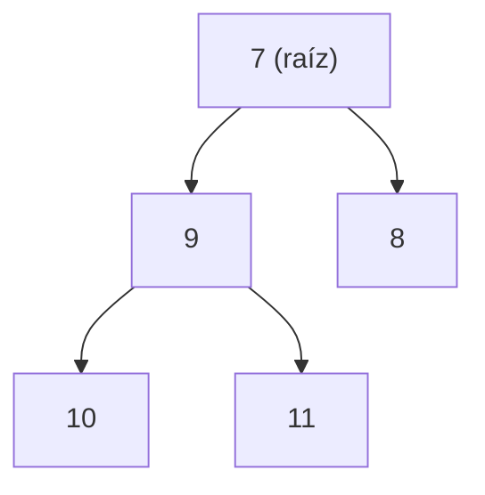

# AyED 2026 — Semana 3: Árboles Binarios

---

## Contexto de Conexión

Hasta ahora trabajamos con estructuras **lineales**: listas, pilas y colas, donde los elementos se encadenan uno tras otro. Esta semana damos el salto a estructuras **no lineales**: los árboles. La motivación es natural — muchos problemas reales tienen una organización jerárquica (decisiones, expresiones matemáticas, clasificaciones) que no se puede modelar bien con una secuencia plana.

---

## Conceptos Core

- **Árbol binario**: colección de nodos, vacía o formada por una raíz R y dos subárboles T1 (izquierdo) y T2 (derecho), cada uno también árbol binario.
- **Raíz**: nodo distinguido del que "cuelga" el resto del árbol.
- **Hoja**: nodo sin hijos (grado 0).
- **Hermanos**: nodos con el mismo padre.
- **Camino**: secuencia de nodos n1, n2, ..., nk donde cada ni es padre de ni+1. Su longitud es k-1 (número de aristas).
- **Profundidad de ni**: longitud del camino desde la raíz hasta ni. La raíz tiene profundidad 0.
- **Altura de ni**: longitud del camino más largo desde ni hasta una hoja. Las hojas tienen altura 0.
- **Altura del árbol**: altura de la raíz.
- **Grado de ni**: cantidad de hijos de ni (en un árbol binario, máximo 2).
- **Ancestro / Descendiente**: si existe un camino de n1 a n2, entonces n1 es ancestro de n2 y n2 es descendiente de n1.
- **Árbol binario lleno**: cada nodo interno tiene exactamente 2 hijos y todas las hojas están en el mismo nivel h.
- **Árbol binario completo**: lleno hasta el nivel h-1, y el nivel h se completa de izquierda a derecha.
- **Preorden**: raíz → hijo izquierdo → hijo derecho.
- **Inorden**: hijo izquierdo → raíz → hijo derecho.
- **Postorden**: hijo izquierdo → hijo derecho → raíz.
- **Por niveles**: se recorre nivel a nivel usando una cola.
- **Árbol de expresión**: árbol binario donde los nodos internos son operadores y las hojas son operandos.
- **Notación infija**: operador entre operandos, con paréntesis para indicar precedencia. Ej: `(a + b) * c`
- **Notación prefija**: operador antes de los operandos. Ej: `* + a b c`
- **Notación postfija (polaca inversa)**: operador después de los operandos. Ej: `a b + c *`
- **Precedencia de operadores**: `^` > `*, /` > `+, -`

---

## Desarrollo

### 1. Definición y estructura

Un árbol binario es una estructura **recursiva**: cada nodo puede tener a lo sumo dos hijos, llamados hijo izquierdo e hijo derecho. La definición recursiva es clave para entender los recorridos.

```
        7
       / \
      3   4
     / \ / \
    8  12 11  2
   /\ /
  6  5 1
      \
       9
```

Sobre este árbol: Profundidad(8) = 2, Altura(8) = 2, Altura(5) = 1, Ancestros(11) = {7, 4}.

---

### 2. Árbol lleno vs. completo

**Árbol binario lleno** de altura h:
- Todo nodo interno tiene exactamente 2 hijos.
- Todas las hojas están en el nivel h.
- Cantidad de nodos: **N = 2^(h+1) - 1**

¿Por qué? En cada nivel i hay exactamente 2^i nodos, entonces:

N = 2⁰ + 2¹ + 2² + ... + 2^h = **2^(h+1) - 1** (suma de serie geométrica de razón 2)

**Árbol binario completo** de altura h:
- Es lleno hasta el nivel h-1.
- El nivel h se llena de **izquierda a derecha** (puede estar incompleto).
- Cantidad de nodos: **2^h ≤ N ≤ 2^(h+1) - 1**

| Tipo | Condición del último nivel | Nodos |
|------|---------------------------|-------|
| Lleno | Todas las hojas en nivel h | 2^(h+1) - 1 |
| Completo | Nivel h lleno de izq. a der. | entre 2^h y 2^(h+1) - 1 |

---

### 3. Representación: Hijo Izquierdo - Hijo Derecho

Cada nodo almacena tres cosas: su dato, una referencia al hijo izquierdo y una referencia al hijo derecho (ambas pueden ser `null`).

```java
public class NodoBinario<T> {
    private T dato;
    private NodoBinario<T> hijoIzquierdo;
    private NodoBinario<T> hijoDerecho;
}
```

---

### 4. Recorridos

Los tres recorridos clásicos son **recursivos** y varían solo en el orden en que se procesa la raíz respecto de sus hijos.

#### Preorden (raíz - izq - der)
```
preorden(nodo):
    imprimir(nodo.dato)
    si nodo.tieneHijoIzquierdo → preorden(hijoIzquierdo)
    si nodo.tieneHijoDerecho   → preorden(hijoDerecho)
```

#### Inorden (izq - raíz - der)
```
inorden(nodo):
    si nodo.tieneHijoIzquierdo → inorden(hijoIzquierdo)
    imprimir(nodo.dato)
    si nodo.tieneHijoDerecho   → inorden(hijoDerecho)
```

#### Postorden (izq - der - raíz)
```
postorden(nodo):
    si nodo.tieneHijoIzquierdo → postorden(hijoIzquierdo)
    si nodo.tieneHijoDerecho   → postorden(hijoDerecho)
    imprimir(nodo.dato)
```

#### Por niveles (usa una Cola)
```
porNiveles(raiz):
    encolar(raiz)
    mientras (cola no vacía):
        v = desencolar()
        imprimir(v.dato)
        si v.tieneHijoIzquierdo → encolar(hijoIzquierdo)
        si v.tieneHijoDerecho   → encolar(hijoDerecho)
```

> El recorrido por niveles no es recursivo: necesita una **cola** para procesar nivel a nivel.

#### Ejemplo con el árbol a) de la ejercitación:

```
    7
   / \
  9   8
 / \
10  11
```

| Recorrido | Resultado |
|-----------|-----------|
| Preorden  | 7 9 10 11 8 |
| Inorden   | 10 9 11 7 8 |
| Postorden | 10 11 9 8 7 |

---

### 5. Reconstruir un árbol a partir de sus recorridos

Con **inorden + postorden** (o inorden + preorden) se puede reconstruir unívocamente el árbol.

**Estrategia:**
1. En **postorden**, el último elemento es siempre la **raíz**.
2. Buscar esa raíz en el **inorden**: todo lo que queda a su izquierda es el subárbol izquierdo, todo lo que queda a su derecha es el subárbol derecho.
3. Aplicar recursivamente a cada subárbol.

**Ejemplo** — inorden: `C B F E G A D I H` / postorden: `C F G E B I H D A`

- Raíz = **A** (último del postorden)
- En inorden: `C B F E G` | A | `D I H` → subárbol izquierdo = {C,B,F,E,G}, subárbol derecho = {D,I,H}
- Para el subárbol izquierdo: raíz = **B** (último de `C F G E B` en postorden)
- Para el subárbol derecho: raíz = **D** (último de `I H D` en postorden)
- Continuando recursivamente se obtiene:



---

### 6. Árboles de decisión

Un árbol binario puede modelar un proceso de **toma de decisiones** donde cada nodo interno es una pregunta con respuesta Sí/No, y cada hoja es una conclusión. Cada camino desde la raíz a una hoja representa una secuencia de decisiones.

Usos: investigación operativa, análisis financiero, Machine Learning.

---

### 7. Árboles de Expresión

Un **árbol de expresión** es un árbol binario donde:
- Los **nodos internos** son operadores (`+`, `-`, `*`, `/`, `^`).
- Las **hojas** son operandos (variables o constantes).

No se necesitan paréntesis: la estructura del árbol determina la precedencia.

**Relación recorridos ↔ notaciones:**

| Recorrido | Notación resultante |
|-----------|-------------------|
| Inorden | Infija (con paréntesis) |
| Preorden | Prefija |
| Postorden | Postfija |

**Ejemplo** — expresión `a * (b*d + c) + (e + f*g)`:

```
         +
        / \
       *   +
      / \ / \
     a  + e  *
       /\ / \
      * c f  g
     / \
    b   d
```

- Prefija:  `+ * a + * b d c + e * f g`
- Postfija: `a b d * c + * e f g * + +`
- Infija:   `((a * ((b * d) + c)) + (e + (f * g)))`

---

### 8. Construcción del árbol desde expresión postfija

Usa una **Pila**. Algoritmo:

```
para cada carácter de la expresión:
    si es operando:
        crear nodo hoja y apilar
    si es operador:
        crear nodo R con ese operador
        desapilar → hijo DERECHO de R
        desapilar → hijo IZQUIERDO de R
        apilar R
```

> ¡Ojo con el orden! El primero que se desapila va a la **derecha**, el segundo a la **izquierda**.

**Traza con `a b d * c + * e f g * + +`:**

1. `a` → apilar nodo(a)
2. `b` → apilar nodo(b)
3. `d` → apilar nodo(d)
4. `*` → R1=`*`, der=d, izq=b → apilar R1(`b*d`)
5. `c` → apilar nodo(c)
6. `+` → R2=`+`, der=c, izq=R1 → apilar R2(`b*d+c`)
7. `*` → R3=`*`, der=R2, izq=a → apilar R3(`a*(b*d+c)`)
8. `e` → apilar nodo(e)
9. `f` → apilar nodo(f)
10. `g` → apilar nodo(g)
11. `*` → R4=`*`, der=g, izq=f → apilar R4(`f*g`)
12. `+` → R5=`+`, der=R4, izq=e → apilar R5(`e+f*g`)
13. `+` → R6=`+`, der=R5, izq=R3 → **resultado final**

---

### 9. Construcción del árbol desde expresión prefija

La expresión prefija se procesa **recursivamente**: el primer carácter siempre es la raíz.

```
ArbolExpresion(exp):
    si exp vacía → nada
    si primer carácter es operador:
        crear nodo raíz R
        ArbolExpresion(subArbolIzq de R, resto de exp)
        ArbolExpresion(subArbolDer de R, resto de exp)
    si es operando:
        crear nodo hoja
```

---

### 10. Construcción del árbol desde expresión infija

Se hace en **dos pasos**:

**Paso (i): Convertir infija → postfija** (algoritmo de la pila con precedencia)

Reglas:
- Operando → va directo a la salida.
- Operador → se compara con el tope de la pila:
  - Si tiene **mayor** prioridad que el tope → se apila.
  - Si tiene **menor o igual** prioridad → se desapila el tope a la salida, y se repite la comparación.
- `(` → siempre se apila (actúa como si tuviera máxima prioridad para apilar, pero nunca se desapila por prioridad).
- `)` → se desapila todo hasta encontrar el `(`, descartando ambos.
- Al final → desapilar todo a la salida.

**Precedencia** (de mayor a menor): `^` > `*, /` > `+, -`

**Ejemplo:** `2 + 5 * 3 + 1` → postfija: `2 5 3 * + 1 +`

**Paso (ii): Aplicar el algoritmo de construcción desde postfija** (sección 8).

---

### 11. Evaluar un árbol de expresión

También es **recursivo**: se evalúa el subárbol izquierdo, el derecho, y se aplica el operador de la raíz.

```java
Integer evaluarAE(NodoBinario A) {
    if (A.dato es operando) return A.dato;
    int izq = evaluarAE(A.hijoIzquierdo);
    int der = evaluarAE(A.hijoDerecho);
    switch (A.dato) {
        case '+': return izq + der;
        case '-': return izq - der;
        case '*': return izq * der;
        case '/': return izq / der;
    }
}
```

---

### 12. Evaluar una expresión postfija directamente (sin árbol)

También con una **Pila**:

```
para cada carácter:
    si es operando → apilar
    si es operador:
        O2 = desapilar
        O1 = desapilar
        R = O1 operador O2
        apilar R
resultado = tope de la pila
```

> El orden importa: O1 es el de **abajo**, O2 el de **arriba** en la pila (O1 op O2).

**Ejemplo:** `2 5 3 * + 1 +`

| Paso | Pila |
|------|------|
| 2 | [2] |
| 5 | [2, 5] |
| 3 | [2, 5, 3] |
| `*` | O2=3, O1=5 → 5*3=15 → [2, 15] |
| `+` | O2=15, O1=2 → 2+15=17 → [17] |
| 1 | [17, 1] |
| `+` | O2=1, O1=17 → 17+1=18 → [18] |

**Resultado: 18** ✓

---

## Visualización

### Los 4 recorridos en un árbol



| Recorrido | Orden de visita |
|-----------|----------------|
| Preorden | raíz → izq → der |
| Inorden | izq → raíz → der |
| Postorden | izq → der → raíz |
| Por niveles | nivel 0, nivel 1, nivel 2... |

### Fórmula clave: árbol lleno de altura h

```
Nivel 0:  1 nodo  (= 2⁰)
Nivel 1:  2 nodos (= 2¹)
Nivel 2:  4 nodos (= 2²)
...
Nivel h: 2^h nodos

Total N = 2⁰ + 2¹ + ... + 2^h = 2^(h+1) - 1
```

---

## Lo que no podés ignorar

> 1. **Profundidad ≠ Altura**: la profundidad mide desde la raíz hacia abajo (cuánto tardé en llegar al nodo), la altura mide desde el nodo hacia abajo hasta la hoja más lejana.
> 2. **Árbol lleno ≠ completo**: lleno = todas las hojas al mismo nivel. Completo = lleno hasta h-1 y último nivel de izq. a der. Todo árbol lleno es completo, pero no al revés.
> 3. **Fórmula del árbol lleno**: N = 2^(h+1) - 1. Para el completo: 2^h ≤ N ≤ 2^(h+1) - 1.
> 4. **Reconstrucción del árbol**: con inorden + postorden (o inorden + preorden) se reconstruye unívocamente. Con solo preorden + postorden no alcanza.
> 5. **Por niveles usa una Cola**: es el único recorrido no recursivo entre los cuatro.
> 6. **Recorrido ↔ notación**: inorden = infija, preorden = prefija, postorden = postfija.
> 7. **En la pila para postfija**: el primer desapilado es el hijo DERECHO, el segundo es el IZQUIERDO. Este orden es crítico y fácil de confundir.
> 8. **Infija → postfija**: recordar la precedencia (`^` > `*/` > `+-`) y que el `(` se desapila solo cuando aparece `)`.

